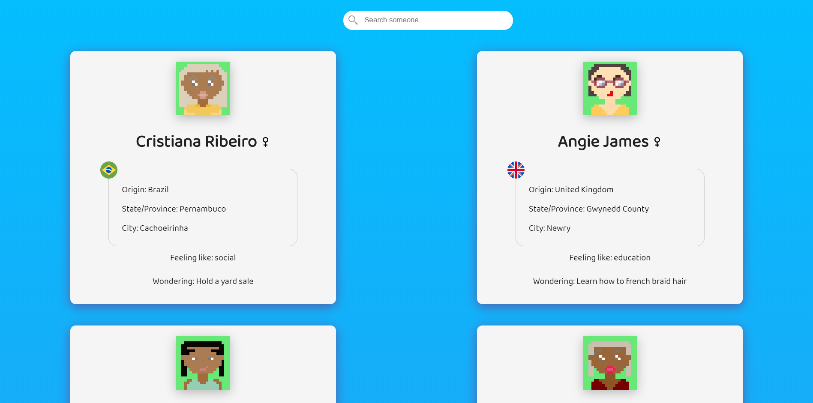

# Personas

Creates people randomly with some information about each one. What is it for? Do not know. It's just a small project to practice my react skills

### Prerequisites

You will need to have Node.js installed on your computer.

### Running the project

Open your terminal, go inside src folder, type npm start and voilà. Should work. Let me know if don't.

### Built With

* [DiceBear Avatar](https://avatars.dicebear.com/) - Used to generate people's faces
* [Bored API](https://www.boredapi.com/) - Used to generate people's activities
* [RandomUser](https://randomuser.me) - Used to generate people's information like name and origin

### Author

* **Igor Couto** - [igor.fcouto@gmail.com](mailto:igor.fcouto@gmail.com)

### Acknowledgments

* I would like to think of something else to do on this project in the future, but I can't think of anything right now
* Front-end is a new challenge for me and I am just learning react. If you see something incorrect or weird, please don't mind it.
* I cannot guarantee the stability of the public APIs used in this project
